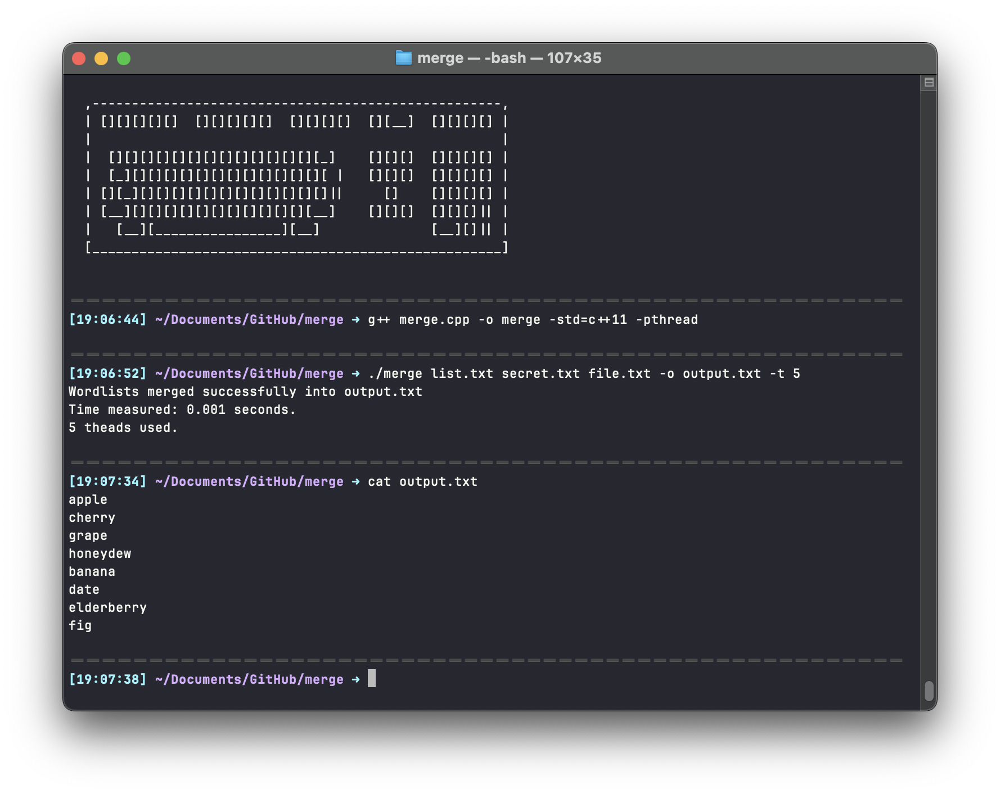

# **Wordlist Merger**

This program merges multiple word lists into a single output file.

<br>



---

## **Usage**

```bash
./merge [-o output_file] [-t num_threads] file1 file2 ... fileN
```

---

### **Options**

- `-o, --output FILE`: Specify output file name. Default is `output.txt`.
- `-t, --threads NUM`: Specify number of threads to use. Default is 4.
- `-h, --help, -?`: Display help message.

---

## **Algorithm**

1. Parse command line arguments to get file names, output file name, and number of threads.
2. Read each input file and add its words to an unordered set.
3. Create a vector of output file streams, one for each thread.
4. Split the set of words into equal-sized chunks for each thread.
5. Launch each thread to process its chunk of words and write them to its output file stream.
6. Wait for all threads to finish.
7. Merge the output files into a single output file.
8. Print success message and elapsed time.

---

## **Implementation**

The program is implemented in C++ and uses the following libraries:

- `iostream` and `fstream` for file I/O.
- `unordered_set` for storing unique words.
- `vector` for storing output file streams.
- `chrono` for measuring elapsed time.
- `thread` for creating and managing threads.

To achieve optimal performance, the program reads and writes files in chunks and uses multiple threads to process the data in parallel.

---

## **Example**

To merge the files `file1.txt`, `file2.txt`, and `file3.txt` into the output file `merged.txt` using 8 threads, run the following command:

```bash
./merge -o merged.txt -t 8 file1.txt file2.txt file3.txt
```


<!-- ## License

This program is released under the MIT license. See `LICENSE` file for details.
-->
